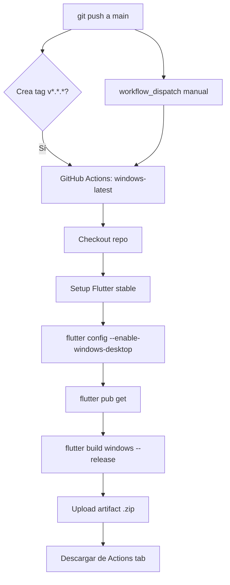

# Build y Mantenimiento — Windows .exe

> **Última actualización:** 21 de mayo de 2026

---

## Índice

1. [Arquitectura del Build](#1-arquitectura-del-build)
2. [Requisitos](#2-requisitos)
3. [Build en CI (GitHub Actions) — Automático](#3-build-en-ci-github-actions--automático)
4. [Build Local (Windows) — Manual](#4-build-local-windows--manual)
5. [Estructura del Artifact](#5-estructura-del-artifact)
6. [Solución de Problemas](#6-solución-de-problemas)
7. [Mantenimiento y Actualización](#7-mantenimiento-y-actualización)
8. [Notas Técnicas (Arquitectura)](#8-notas-técnicas-arquitectura)

---

## 1. Arquitectura del Build

### Diagrama de flujo



### Componentes del artifact

El build genera un ejecutable nativo de Windows de 64 bits. No es un instalador — es una carpeta con todos los archivos necesarios para ejecutar la app:

```
himnario_id_2.exe            ← Launcher (90 KB)
flutter_windows.dll           ← Flutter engine (21 MB)
data/
  app.so                      ← Dart code compilado AOT
  flutter_assets/             ← Assets (DB, fuentes, imágenes)
  icudtl.dat                  ← ICU data (unicode)
sqlite3.dll                   ← SQLite nativo
audioplayers_windows_plugin.dll
window_manager_plugin.dll
desktop_multi_window_plugin.dll
screen_retriever_windows_plugin.dll
dartjni.dll
```

---

## 2. Requisitos

### Para el CI (GitHub Actions)

- **Repositorio** en GitHub con Actions habilitado
- **Token** de GitHub con scope `workflow` (para pushear cambios en `.github/workflows/`)
- No se requiere nada más — el runner `windows-latest` incluye Visual Studio Build Tools

### Para build local (máquina Windows)

- **Windows 10+** (64-bit)
- **Flutter SDK** (stable channel) con Windows desktop habilitado:
  ```powershell
  flutter config --enable-windows-desktop
  ```
- **Visual Studio 2022** con workload "Desktop development with C++"
  - Incluye MSVC v143, Windows SDK, CMake
- **Git** para clonar el repositorio

### Archivos generados necesarios

El proyecto usa archivos generados que **deben estar presentes** para compilar:

| Tipo | Se genera con | ¿Está en git? |
|------|--------------|---------------|
| `.g.dart` (json_serializable) | `dart run build_runner build` | ✅ Sí (forzado) |
| `.freezed.dart` (freezed) | `dart run build_runner build` | ✅ Sí (forzado) |
| Proto gRPC (`lib/proto/generated/`) | `protoc --dart_out=grpc:...` | ✅ Sí (forzado) |

> **⚠️ Importante**: Si alguien regenera estos archivos localmente, deben pushear los cambios.
> Para regenerar:
> ```bash
> dart run build_runner build --delete-conflicting-outputs
> protoc --dart_out=grpc:lib/proto/generated -Iproto proto/hymn_control.proto
> ```

---

## 3. Build en CI (GitHub Actions) — Automático

### Ubicación del workflow

`.github/workflows/build_windows.yml`

### Cómo ejecutarlo

#### Opción A: Manual (recomendado para pruebas)

1. Ir a **GitHub → Actions → Build Windows .exe → Run workflow**
2. Seleccionar `main` como rama
3. Seleccionar rama (ej: `main` o `feature/orden-filtros-admin-crud`)
4. Opcional: escribir versión (ej: `2.0.2`)
5. Hacer clic en **Run workflow**
6. Esperar ~5 minutos
6. Descargar el artifact desde la página del run (sección **Artifacts**)

#### Opción B: Automático (para releases)

Crear un tag con formato `v*.*.*` y pushearlo:

```bash
git tag v2.0.1
git push origin v2.0.1
```

Esto dispara el workflow automáticamente.

### Workflow paso a paso

```yaml
# .github/workflows/build_windows.yml
name: Build Windows .exe

on:
  workflow_dispatch:        # Trigger manual desde GitHub UI
    inputs:
      version:
        description: 'Build version label (e.g. 2.0.1)'
        required: false
        default: 'latest'
  push:
    tags:
      - 'v*.*.*'            # Auto-build en releases

jobs:
  build:
    runs-on: windows-latest # Runner con Visual Studio + Windows SDK

    steps:
      - uses: actions/checkout@v4
      - uses: subosito/flutter-action@v2
        with:
          channel: 'stable'
          cache: true        # Cachea Flutter SDK entre runs

      - run: flutter config --enable-windows-desktop
      - run: flutter pub get
      - run: flutter build windows --release

      - uses: actions/upload-artifact@v4
        with:
          name: himnario_id_2-windows-x64_${{ github.event.inputs.version || github.ref_name }}
          path: build/windows/x64/runner/Release/
```

> **Nota**: El workflow no corre `dart analyze` ni `flutter test` para ahorrar tiempo (~40s). Si se desea agregar validación, insertar antes del build:
> ```yaml
> - run: dart analyze lib/
> - run: flutter test
> ```

---

## 4. Build Local (Windows) — Manual

Si tienes una máquina Windows, puedes buildear localmente:

### Paso 1: Clonar y preparar

```powershell
# Clonar
git clone https://github.com/moy385/HimnarioID_2.0.git
cd HimnarioID_2.0

# Asegurar que los archivos generados están presentes
# (ya están en git, pero si los regeneraste localmente:)
# dart run build_runner build --delete-conflicting-outputs
```

### Paso 2: Habilitar Windows Desktop

```powershell
flutter config --enable-windows-desktop
```

### Paso 3: Obtener dependencias

```powershell
flutter pub get
```

### Paso 4: Buildear

```powershell
# Debug (rápido, para pruebas)
flutter build windows --debug

# Release (óptimo, para distribuir)
flutter build windows --release
```

### Paso 5: Encontrar el ejecutable

```
build/windows/x64/runner/Release/himnario_id_2.exe
```

### Crear un instalador (opcional)

Para distribuir como instalador, usar **Inno Setup**:

1. Descargar [Inno Setup](https://jrsoftware.org/isinfo.php)
2. Crear un script `.iss` que empaquete todo `build/windows/x64/runner/Release/`
3. Compilar el instalador

---

## 5. Estructura del Artifact

### Contenido del .zip descargado de CI

```
himnario_id_2-windows-x64_latest.zip (18 MB)
├── himnario_id_2.exe              (90 KB)  ← Ejecutable principal
├── flutter_windows.dll            (21 MB)  ← Flutter engine
├── sqlite3.dll                    (1.6 MB) ← SQLite nativo
├── audioplayers_windows_plugin.dll (195 KB)
├── window_manager_plugin.dll      (127 KB)
├── desktop_multi_window_plugin.dll (132 KB)
├── screen_retriever_windows_plugin.dll (117 KB)
├── dartjni.dll                    (65 KB)
└── data/
    ├── app.so                     ← Código Dart compilado AOT
    ├── flutter_assets/            ← Assets comprimidos
    │   ├── assets/db/himnario_id.db   ← BD SQLite pre-cargada (~400 himnos)
    │   ├── assets/fonts/              ← Fuentes tipográficas
    │   ├── FontManifest.json
    │   └── ...
    └── icudtl.dat                 ← Datos Unicode (ICU)
```

### Cómo distribuir

El artifact **no es un instalador**. Para distribuirlo:

1. **Opción simple**: Comprimir la carpeta `Release/` y compartir el .zip
2. **Opción profesional**: Usar Inno Setup para crear un instalador `.exe` que:
   - Copie archivos a `Program Files`
   - Cree acceso directo en el menú Inicio
   - Registre en "Agregar o quitar programas"

---

## 6. Solución de Problemas

### Error: `Target of URI doesn't exist: '../../../proto/generated/hymn_control.pbgrpc.dart'`

**Causa**: Los archivos proto generados no existen en `lib/proto/generated/`.

**Solución**:
```bash
# Asegurar que están en git
git checkout main -- lib/proto/generated/

# O regenerarlos
protoc --dart_out=grpc:lib/proto/generated -Iproto proto/hymn_control.proto
```

### Error: `Target of URI hasn't been generated: 'package:...g.dart'`

**Causa**: Archivos `.g.dart` de json_serializable no existen.

**Solución**:
```bash
git checkout main -- "**/*.g.dart" "**/*.freezed.dart"
# O regenerar:
dart run build_runner build --delete-conflicting-outputs
```

### Error: `MSB8066: Custom build for '...flutter_assemble.vcxproj' exited with code 1`

**Causa**: Error de compilación de Dart detectado por MSVC.

**Verificar**: Revisar los errores `Dart` en la salida de MSBuild (no los de C++).
Generalmente son errores de tipo/subtipo como:
- `'X' isn't a type` → El import no resuelve
- `The method 'X' isn't defined` → Clase no encontrada

**Diagnóstico**: Correr `dart analyze lib/` localmente. Si pasa local pero falla en CI,
revisar imports relativos que salgan de `lib/` — Windows AOT no los resuelve.

### Error: `cannot overwrite 'lib/proto/generated': Directory not empty`

**Causa**: Al mover archivos de `proto/generated/` a `lib/proto/generated/`.

**Solución**:
```bash
cp -r proto/generated/* lib/proto/generated/
rm -rf proto/generated/
```

### Error: GitHub push rejected — `refusing to allow a Personal Access Token to create or update workflow`

**Causa**: El token no tiene scope `workflow`.

**Solución**: Ir a GitHub → Settings → Developer settings → Personal access tokens →
Editar token → Agregar scope `workflow`.

---

## 7. Mantenimiento y Actualización

### Cada vez que se necesita un nuevo .exe

**Opción rápida (sin cambios de código):**
1. Ir a **GitHub → Actions → Build Windows .exe → Run workflow**
2. Descargar artifact

**Opción con nuevos cambios:**
```bash
git add . && git commit -m "descripción"
git push origin main
# Luego ir a Actions y ejecutar workflow manualmente
```

### Después de regenerar archivos Dart generados

Si alguien corre `build_runner` o `protoc` localmente y los archivos cambian:

```bash
# Verificar qué cambió
git diff --stat

# Commit de los nuevos generados
git add --force "**/*.g.dart" "**/*.freezed.dart" lib/proto/generated/
git commit -m "chore: regenerar archivos build_runner y proto"
git push origin main
```

### Actualizar versión de Flutter SDK en CI

En `.github/workflows/build_windows.yml`:

```yaml
- uses: subosito/flutter-action@v2
  with:
    channel: 'beta'    # Cambiar a 'stable', 'beta', o version específica
    flutter-version: '3.27.0'  # Opcional: pin a versión exacta
```

### Agregar un paso de pruebas

Si se quiere que el build corra tests antes de compilar:

```yaml
- run: dart analyze lib/
- run: flutter test
- run: flutter build windows --release
```

### Convertir a instalador (Inno Setup)

Agregar un step al workflow:

```yaml
- name: Create installer
  run: |
    choco install innosetup -y
    iscc installer.iss
- uses: actions/upload-artifact@v4
  with:
    name: himnario_id_2-installer
    path: installer/Output/
```

---

## 8. Notas Técnicas (Arquitectura)

### Por qué el build es en CI y no local

- El desarrollador principal usa **Linux** (Ubuntu)
- `flutter build windows` requiere **Visual Studio Build Tools** (MSVC), no mingw
- El toolchain de Flutter para Windows **solo funciona en Windows nativo**
- GitHub Actions provee runners Windows sin costo

### Archivos generados en el repo

| Archivo | Propósito | ¿Por qué está en git? |
|---------|-----------|----------------------|
| `lib/data/models/*.g.dart` | Serialización JSON | El CI no corre `build_runner` (tarda ~2min) |
| `lib/domain/entities/*.freezed.dart` | Data classes inmutables | Misma razón |
| `lib/proto/generated/hymn_control.pb*.dart` | Stubs gRPC | El CI no tiene `protoc` instalado |

### Lección aprendida: Windows AOT y rutas relativas

**⚠️ El AOT compiler de Windows no resuelve imports relativos que suban más allá de `lib/`.**

Ejemplo de import **problemático**:
```dart
// En lib/data/datasources/remote/grpc_control_datasource.dart
import '../../../proto/generated/hymn_control.pbgrpc.dart';
// ↑ Busca lib/proto/generated/ en vez de proto/generated/
```

**Solución**: Los archivos importados deben estar DENTRO de `lib/`:
```
proto/generated/     →  lib/proto/generated/     ✅
```

Los imports relativos desde `lib/data/datasources/remote/` con `../../../proto/generated/`
resuelven correctamente a `lib/proto/generated/`.

### Dependencias nativas

| Plugin | DLL generada | Propósito |
|--------|-------------|-----------|
| `audioplayers` | `audioplayers_windows_plugin.dll` | Reproducción de audio |
| `window_manager` | `window_manager_plugin.dll` | Control de ventana |
| `desktop_multi_window` | `desktop_multi_window_plugin.dll` | Múltiples ventanas |
| `screen_retriever` | `screen_retriever_windows_plugin.dll` | Info de pantallas |
| `sqflite_common_ffi` | `sqlite3.dll` | Base de datos SQLite |

---

> **Ver también**: `doc/tareas_pendientes.md` — lista completa de pendientes del proyecto
